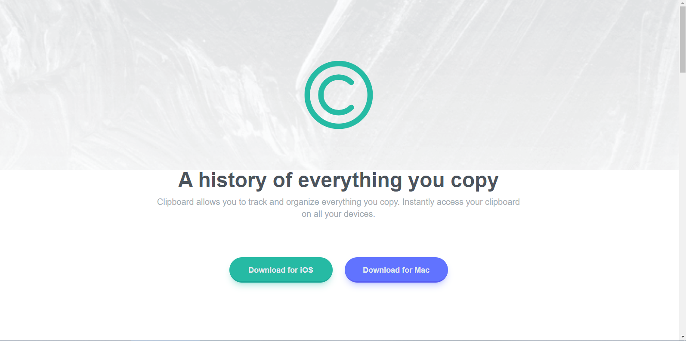

# Frontend Mentor - Clipboard landing page solution

This is a solution to the [Clipboard landing page challenge on Frontend Mentor](https://www.frontendmentor.io/challenges/clipboard-landing-page-5cc9bccd6c4c91111378ecb9). Frontend Mentor challenges help you improve your coding skills by building realistic projects.

## Table of contents

- [Overview](#overview)
  - [The challenge](#the-challenge)
  - [Screenshot](#screenshot)
  - [Links](#links)
- [My process](#my-process)
  - [Built with](#built-with)
  - [What I learned](#what-i-learned)
  - [Continued development](#continued-development)
  - [Useful resources](#useful-resources)
- [Author](#author)

## Overview

### The challenge

Users should be able to:

- View the optimal layout for the site depending on their device's screen size
- See hover states for all interactive elements on the page

### Screenshot




### Links

- Solution URL: [Github repo](https://www.github.com/Odohofre/clipboard-landing-page)
- Live Site URL: [live site URL](https://odohofre.github.io/clipboard-landing-page)

## My process

### Built with

- Semantic HTML5 markup
- Flexbox
- Mobile-first workflow
- [Tailwind CSS](https://www.tailwindcss.com/) - CSS framework

### What I learned

- I learned how to use tailwind css

Install **Tailwind CSS** via npm and create **tailwind.config.js** file

```javascript
npm install -D tailwindcss
npx tailwindcss init
```

Start the Tailwind CLI build process

```javascript
npx tailwindcss -i ./style.css -o ./output.css --watch
```

### Continued development

- Combine Tailwind with React

### Useful resources

- [Scrimba's Tailwind Lesson](https://www.scrimb.com/learn/tailwind/) - This contains amazing lessons which helped me finally understand Tailwind Css. I'd recommend it to anyone still learning this concept. I really liked this pattern and will use it going forward.
- [Tailwind Official Documentation](https://www.tailwindcss.com/docs) - This helped in understanding tailwind css
- [CSS-Tricks FlexBox Guide](https://www.css-tricks.com/snippets.css/a-guide-to-flexbox/) - This helped me to understand flexbox.  I'd recommend it to anyone still learning this concept.

## Author

- Website - [Bright Odohofre](https://odohofre.github.io)
- Frontend Mentor - [@Odohofre](https://www.frontendmentor.io/profile/Odohofre)
- Twitter - [@B_Odohofre](https://www.twitter.com/B_Odohofre)
